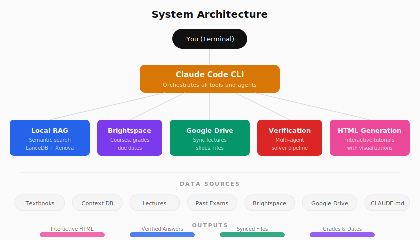
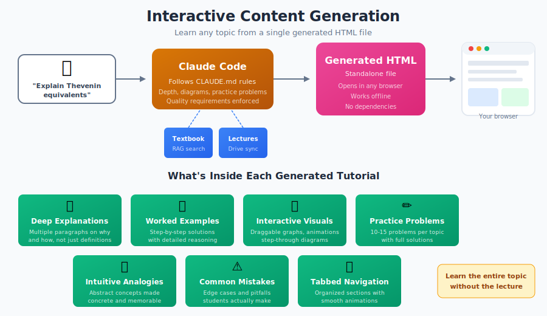
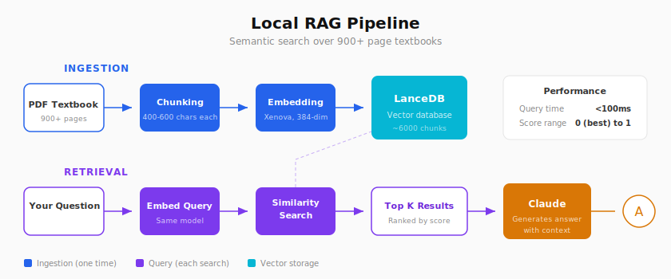
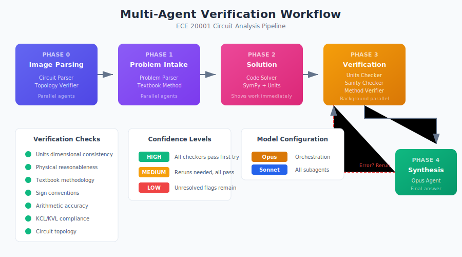

# BoilerCourses-AI

Your AI powered academic command center.

Stop digging through 900 page textbooks. Stop hunting for that one lecture slide from week 3. Stop manually downloading files from 6 different Google Drive folders. Stop switching between Brightspace, Google Drive, and your notes app.

BoilerCourses-AI combines local semantic search, intelligent file organization, and direct Brightspace access into one unified workspace. Ask questions in plain English and get answers pulled directly from your course materials. Check your assignments and grades without opening a browser.

The real power is generative interactive content. Tell Claude any topic you need to learn and it generates comprehensive HTML tutorials with visualizations, animations, tabbed navigation, and practice problems. Organic chemistry mechanisms with electron flow animations. Economics supply and demand curves you can drag. Physics free body diagrams that respond to changing forces. Data structures visualized step by step. Any subject, any concept. These are standalone files you open in any browser, thorough enough to learn entire topics without the lecture.

This repo includes pre-built optimized workflows ready to use. Custom CLAUDE.md instructions for generating interactive HTML study guides. Multi-agent orchestration pipelines with verification phases. Textbook integration patterns. Practice problem formatting rules. These workflows took significant iteration to get right and are recommended to keep as starting points. You can also modify them for your preferences or build entirely new ones for different subjects.

Built by students, for students. Works with any university, any major, any course.

Powered by Claude Code CLI, local RAG, and the Brightspace MCP.

<p align="center">
  
</p>

## What You Can Do With This

### Search Your Textbooks Instantly

Ingest a 900 page PDF and search it by meaning, not keywords. Ask "how do flip flops work" and find the exact pages that explain sequential circuits, even if those pages never use the phrase "flip flop."

```
query_documents("karnaugh map simplification", limit=5)
```

Returns matching chunks with relevance scores. Lower scores mean better matches. Each result includes the chunk position so you can calculate the approximate page number.

### Generate Interactive Study Guides On Demand

**This is the flagship feature.** Tell Claude any topic and it generates a complete, standalone HTML tutorial you can open in any browser. Not templates. Not fill in the blank. Fully generated content with interactive visualizations, animations, and practice problems.

<p align="center">
  
</p>

**What you get in each generated tutorial:**

Deep explanations with multiple paragraphs covering why and how, not just definitions. Numerous worked examples with step by step solutions. Intuitive analogies that make abstract concepts concrete. Edge cases and common student mistakes highlighted. 10 to 15 practice problems with detailed solutions. Interactive visualizations from draggable graphs to animated diagrams. Tabbed navigation with smooth animations. Multiple explanations of the same concept for different learning styles.

**Works for any subject.** Organic chemistry reaction mechanisms with animated electron flow. Microeconomics graphs you can manipulate. Algorithm visualizations that step through execution. Circuit diagrams with current flow animations. Historical timelines with expandable events. Language conjugation drills with instant feedback. Whatever you are studying.

**Learn entire topics without the lecture.** These tutorials are thorough enough to be your primary learning resource. Open in any browser, works offline, no dependencies.

The included CLAUDE.md files contain optimized instructions for generating these tutorials, specifying depth requirements, diagram standards, practice problem counts, and formatting rules. These took iteration to refine and produce consistently high quality output.

### Sync Files From Google Drive

One command pulls lecture slides, assignments, and notes from all your configured Google Drive folders.

```bash
python3 scripts/pull_ece_files.py
```

Supports both OAuth 2.0 for personal accounts and Service Account for shared course folders. Store credentials in environment variables to keep them out of your repo.

### Solve Problems With AI Verification

For circuit analysis and similar technical problems, Boiler-AI uses a multi-agent verification workflow that catches errors at every stage.

Phase 0 parses circuit diagram images and verifies topology.
Phase 1 extracts problem data and looks up textbook methods in parallel.
Phase 2 solves symbolically using SymPy then substitutes values.
Phase 3 runs three independent checkers in parallel for units, physical sanity, and textbook methodology compliance.
Phase 4 synthesizes results and reports confidence level.

This workflow catches problem misreading, wrong methodology, arithmetic mistakes, unit errors, and physically nonsensical answers before you submit.

### Access Brightspace Directly

The Brightspace MCP integration lets you query your courses, assignments, and grades through Claude using natural language.

"What assignments are due this week?"
"Show my grades for ECE 270"
"List all my enrolled courses"

Uses Playwright browser automation since D2L does not provide API access to students. Handles Duo 2FA automatically. Credentials stored securely via environment variables.

Source available at github.com/pranav-vijayananth/brightspace-mcp-server

## Quick Start

### Clone and Setup

```bash
git clone https://github.com/YOUR_USERNAME/boiler-ai.git
cd boiler-ai
python3 -m venv venv
source venv/bin/activate
pip install -r requirements.txt
```

### Install Claude Code CLI

Follow the installation instructions at claude.ai/claude-code

### Configure Google Drive (Optional)

For OAuth 2.0 to access your personal Drive, create OAuth 2.0 credentials in Google Cloud Console, download as credentials.json to the scripts folder, then run the sync script and authorize in browser.

For Service Account to access shared folders, create a Service Account in Google Cloud Console, download the JSON key as service_account.json, then share your Drive folders with the service account email.

### Install poppler for PDF Images

On macOS run brew install poppler. On Ubuntu or Debian run sudo apt-get install poppler-utils.

### Start Using

```bash
cd boiler-ai
claude
```

Claude automatically reads CLAUDE.md and understands your project structure.

## Features Deep Dive

### Local RAG System

<p align="center">
  
</p>

RAG stands for Retrieval Augmented Generation. Your PDF gets split into small chunks of 400 to 600 characters each. Each chunk becomes a searchable vector using Xenova embeddings stored in LanceDB. When you query, the system finds chunks that match your question by meaning, not exact words.

A 900 page textbook creates approximately 6000 to 7000 searchable chunks.

To ingest a textbook.
```
ingest_file("/path/to/textbook.pdf")
```

To search.
```
query_documents("sequential circuit state machine design", limit=5)
```

Each result contains a chunkIndex (divide by 7 for approximate page number), the matching text, and a relevance score from 0 (perfect) to 1 (weak). Good matches typically score 0.15 to 0.35.

### Context Database

Each course has a local context_db folder that stores class specific knowledge. This is searched BEFORE the textbook RAG system, providing faster answers for common questions and storing knowledge that textbooks do not cover.

The context database stores formulas and equations you use frequently, worked examples from lectures and homework, concept explanations in your own words, lab procedures and common debugging tips, SystemVerilog patterns for digital design, and anything else specific to how your professor teaches the course.

Each context_db folder has a .schema.json file defining the categories available for that course. ECE 270 includes verilog and lab_notes categories. HONR 299 includes readings and research categories. You can add new categories by editing the schema.

Search priority order. First the context_db is searched for matching entries. If nothing relevant is found, the textbook RAG is searched. Context_db entries can include related_textbook_sections to guide deeper searches when needed.

Entries are JSON files with id, title, content, keywords for matching, and optional textbook references. As you learn new things or solve problems, add them to the appropriate context_db category so future questions get answered instantly.

### Hybrid PDF Workflow

RAG extracts text only. Diagrams, circuit schematics, truth tables, and figures are lost. For technical textbooks, 30 to 40 percent of content references images.

The hybrid workflow solves this.

Step 1. Search RAG to find the topic and note the chunk index.
Step 2. Calculate approximate page number (chunkIndex divided by 7).
Step 3. Extract that page as an image.

```bash
pdftoppm -png -f 245 -l 247 "textbook.pdf" "page"
```

Step 4. View page-245.png with all diagrams intact.

### Generative Interactive Content

This is the flagship feature. Claude generates comprehensive tutorials as standalone HTML files on demand for any subject.

Generated content includes extensive text explanations with multiple paragraphs covering the why and how, not just definitions. Numerous worked examples with step by step solutions. Intuitive analogies that make abstract concepts concrete. Edge cases and common student mistakes highlighted so you avoid them. Practice problems with detailed solutions. Interactive visualizations, from draggable graphs to animated diagrams to step through algorithms. Tabbed navigation with smooth animations to organize complex topics. Multiple explanations of the same concept for different learning styles.

The included CLAUDE.md files contain battle tested instructions that produce consistently excellent output. Requirements for explanation depth, diagram quality, problem counts, and formatting. Keep these as they are or customize for your preferences.

The tutorials are thorough enough that you could learn the entire topic from the HTML file alone without needing the lecture. Open in any browser, works offline, no dependencies.

### Google Drive Integration

The sync script supports multiple folders from different courses. Each run checks for new or updated files and downloads only what changed.

OAuth 2.0 is best for accessing your personal Drive with your consent. Service Account is best for automated sync of shared folders without browser interaction.

API methods available.
```python
from google_drive_api import GoogleDriveAPI

drive = GoogleDriveAPI()
drive.authenticate()

files = drive.list_files(folder_id="FOLDER_ID")
files = drive.search_files("midterm")
content = drive.read_file(file_id)
drive.upload_file("/path/to/assignment.pdf")
```

Store credentials in environment variables.
```bash
export GOOGLE_DRIVE_TOKEN='{"token": "...", "refresh_token": "..."}'
export GOOGLE_DRIVE_CREDENTIALS='{"installed": {"client_id": "..."}}'
```

### Circuit Solvers

For electrical engineering courses, SymPy based solvers handle nodal analysis, KVL equations, and unit tracking.

Set up equations symbolically showing each KVL and KCL equation. Solve the system symbolically. Substitute numerical values only at the end. Use SymPy units module to track units throughout. This eliminates mental math errors and provides both symbolic and numerical answers.

### Multi-Agent Verification Workflows

<p align="center">
  
</p>

The repo includes pre-built multi-agent workflows ready to use. The circuits workflow demonstrates the full pattern with six specialized agents running in coordinated phases.

Problem Parser Agent extracts given values, conditions, and what quantity is asked for.
Textbook Method Agent queries the course textbook for similar problems and recommended methods.
Code Solver Agent uses Python and SymPy to solve symbolically then numerically.
Units Checker Agent verifies dimensional consistency at every step.
Sanity Checker Agent confirms physical reasonableness of results.
Textbook Method Verifier Agent ensures the solution matches how the textbook teaches it.

The main orchestrating agent runs on Opus for superior reasoning. All subagents run on Sonnet for cost efficiency.

Confidence levels.
High means all checkers passed on first attempt.
Medium means reruns were needed but all checkers eventually passed.
Low means unresolved flags remain.

These workflows are ready to use as configured. You can also modify them, adding domain specific verification agents for your field, removing agents you do not need, changing parallelization, or defining custom resolution protocols.

### LLM Performance on Circuit Analysis (Research Findings)

Recent benchmarks specifically evaluating LLMs on undergraduate circuit analysis problems reveal significant differences.

**Gemini 3 Pro** achieved the highest baseline accuracy at 79.52% on circuit problems (66 of 83 correct). With an enhanced pipeline including ngspice verification, accuracy reached 97.59%. Primary failure modes include source polarity recognition errors (35% of failures), current direction hallucinations (29%), and element connection hallucinations (12%). Source: [Enhancing LLMs for End-to-End Circuit Analysis](https://arxiv.org/html/2512.10159)

**GPT-4o** achieved 48.04% accuracy on the CIRCUIT benchmark dataset (510 undergraduate circuit problems). However, pass@5/5 unit test accuracy (requiring correct answers across all five numerical variants of a problem) was only 27.45%, revealing inconsistency in reasoning. Performance improved to 67% on problems not requiring circuit topology interpretation. Source: [CIRCUIT Benchmark](https://arxiv.org/html/2502.07980v1)

**Claude** was selected by the IDEEAS Lab for its "stronger ability to analyze circuit diagrams" compared to alternatives. It performs reliably on digital circuits but shows "variable accuracy with analog circuits" and is "less reliable with complex analog behaviors." Verification against simulation is recommended. Source: [IDEEAS Lab Teaching Resources](https://ideeaslab.com/resources/teaching/electrical-engineering-claude/)

**Wolfram Alpha integration** provides reliable symbolic computation that any LLM struggles with natively. Combining an LLM for problem interpretation with Wolfram for computation addresses the "can't do actual nontrivial computations" limitation of neural networks. Works with GPT-4, Claude, and Gemini. Source: [Wolfram AI Ecosystem](https://www.wolfram.com/artificial-intelligence/)

**Recommendation for ECE problems.** Use Gemini 3 Pro as the primary solver for circuit analysis when accuracy is critical, especially with an ngspice or SPICE verification step. Use Claude for diagram interpretation, concept explanation, and textbook methodology verification. Use Wolfram Alpha (via API or plugin) for any symbolic computation or numerical verification. The multi-agent workflow in this repo can be configured to route different subtasks to different models.

Technical Architecture

### The Stack

The system is built on a modular architecture using the Model Context Protocol (MCP).

*   **Vector Database**: `lancedb` folder. Stores the semantic embeddings of your textbooks. It allows for efficient similarity search without needing an external API key or cloud vector store.
*   **Embeddings**: **Xenova/all-MiniLM-L6-v2**. These run locally via `transformers.js` to convert your textbook text into 384-dimensional vectors.
*   **MCP Server**: `mcp-local-rag`. A custom MCP server that handles the logic for:
    *   Ingesting PDFs (chunking text, generating embeddings).
    *   Retrieving context (searching LanceDB).
    *   This server runs as a subprocess (`stdio`) managed by Claude.
*   **Configuration**: `.mcp.json`. This file tells the Claude Desktop app (and CLI) which MCP servers to run.
    *   It defines `local-rag`, pointing to the `mcp-local-rag` package.
    *   It sets environment variables like `BASE_DIR` to tell the server where to look for your course files.

### How Ingestion Works

1.  **Read**: The system reads your PDF.
2.  **Chunk**: Text is split into segments of ~400-600 characters.
3.  **Embed**: Each chunk is passed through the Xenova model to create a vector.
4.  **Store**: The vector and original text are saved to the `lancedb` directory.

When you ask a question, your query is embedded using the same model, and LanceDB finds the mathematically closest text chunks.

## Project Structure

```
boilercourses-ai/
    ECE-20001/                       # Example: Linear Circuit Analysis I
        lectures/
        labs/
        homework/
        exams/
        explanations/                # Generated interactive HTML tutorials
            nodal-analysis-explained.html
            thevenin-norton-visualized.html
        context_db/
            .schema.json
            circuit_formulas.json
            solved_problems.json
        CLAUDE.md                    # Course-specific instructions
    ECE-20002/                       # Example: Linear Circuit Analysis II
        lectures/
        homework/
        context_db/
            .schema.json
            ac_circuits.json
            phasor_analysis.json
        CLAUDE.md
    ECE-270/                         # Example: Introduction to Digital System Design
        lectures/
        labs/
        student-labs-main/           # Cloned course repo (gitignored)
        explanations/
            boolean-algebra.html
            sequential-circuits.html
        context_db/
            .schema.json
            verilog_patterns.json
            lab_notes.json
        CLAUDE.md
    ECE-301/                         # Example: Signals and Systems
        lectures/
        homework/
        context_db/
            .schema.json
            fourier_transforms.json
        CLAUDE.md
    ECE-302/                         # Example: Probabilistic Methods
        lectures/
        context_db/
            .schema.json
        CLAUDE.md
    ECE-368/                         # Example: Data Structures
        lectures/
        labs/
        homework/
        context_db/
            .schema.json
            algorithms.json
            complexity_analysis.json
        CLAUDE.md
    textbooks/                       # PDF textbooks (gitignored)
        circuit-analysis.pdf
        digital-design.pdf
        signals-and-systems.pdf
    scripts/
        google_drive_api.py          # OAuth 2.0 client
        google_drive_service_account.py  # Service Account client
        pull_ece_files.py            # Sync all configured courses
        sync_ece270_labs.py          # Course-specific sync
        requirements.txt
    lancedb/                         # Vector database (gitignored)
    models/                          # Embedding models (gitignored)
    venv/                            # Virtual environment (gitignored)
    config.json                      # Your paths and settings (gitignored)
    config.example.json              # Template configuration
    .mcp.json                        # MCP server configuration (gitignored)
    .gitignore
    CLAUDE.md                        # Global instructions
    README.md
```

## Course Configuration

Each course can have its own CLAUDE.md with custom instructions. These override the main CLAUDE.md for that course folder.

The included CLAUDE.md files are pre-configured with optimized workflows. Instructions for generating interactive HTML with specific depth and quality requirements. Multi-agent verification pipelines with parallelization strategies. Textbook lookup patterns. Practice problem sourcing rules. These configurations took significant iteration to develop and are recommended to keep.

You can modify any of it. Change the number of practice problems required. Adjust explanation depth. Add or remove verification agents. Swap which models run which agents. Define new workflows for subjects not yet covered. The CLAUDE.md file is the control plane for all agent behavior.

## Example Workflow. ECE 270 Digital Design

ECE 270 demonstrates a complete custom course workflow combining textbook RAG, lab syncing, context database, and interactive content generation.

### Lab Sync System

Labs are hosted on GitHub at github.com/ece270/student-labs and synced locally without overwriting your work.

```bash
python3 scripts/sync_ece270_labs.py
```

The sync script clones the course repo to a temp directory, compares remote labs against your local labs folder, copies only new labs you do not have yet, and syncs new reference files in refs/ without touching existing ones. Your submissions, notes, and modifications in existing labs are never overwritten.

Config.json specifies the labs_path so the script knows where to look.

```json
"ECE 270": {
  "local_folder_name": "ECE 270",
  "labs_path": "student-labs-main",
  "textbook_filename": "Digital Design- Principles and Practices...",
  "context_db_path": "context_db"
}
```

### Folder Structure

The ECE 270 folder organizes materials by type. lectures/ contains lecture PDFs named by topic like lec1.1 and lec1.2. student-labs-main/ contains lab assignments with refs/ holding datasheets for 74HC series chips. explanations/ stores generated interactive HTML tutorials. context_db/ holds class specific knowledge like SystemVerilog patterns and lab debugging tips. Exams/ contains past exams and learning objectives.

### Custom CLAUDE.md Rules

The ECE 270 CLAUDE.md defines course specific behavior.

Practice problem sourcing. Never make up problems. Pull only from actual course materials in priority order. Practice exams first, then homeworks, PCQs, recitations, and lecture iClicker questions. Always cite the source like "From Fall 24 Exam 1, Question 3" so you can find similar problems.

Interactive HTML requirements. Explanations must be comprehensive enough to learn the entire topic without the lecture. At least 10 to 15 practice problems per major topic. Multiple worked examples with step by step solutions. Visual diagrams for every concept that can be visualized.

Textbook integration. Always search the Wakerly textbook when creating explanations. Reference specific page numbers and sections. Extract worked examples from the textbook to supplement lectures.

### Context Database Categories

The ECE 270 context_db schema includes course specific categories. formulas for Boolean algebra and timing calculations. concepts for gate types and circuit design principles. verilog for SystemVerilog syntax, modules, and testbenches. lab_notes for procedures, common issues, and FPGA debugging tips.

### Generated Content

The explanations/ folder stores interactive HTML tutorials created on demand. cmos-explained.html covers CMOS transistors, inverter design, NAND and NOR gates, electrical characteristics, timing analysis, and power consumption with practice questions pulled from lectures 1.4a and 1.4b.

This workflow pattern applies to any technical course. Configure the folder structure in config.json, define course specific rules in CLAUDE.md, set up the context_db schema with relevant categories, and add sync scripts if materials are hosted externally.

## Adding New Courses

Create the folder structure with mkdir.

```bash
mkdir -p courses/NEW-COURSE/{lectures,labs,assignments,exams,context_db}
```

Add the Google Drive folder ID to pull_ece_files.py if syncing from Drive. Add course textbooks to the textbooks folder.

Create a context_db/.schema.json file defining the categories for that course. Copy an existing schema from another course and modify the categories to fit the new subject.

Add the course to config.json with its local_folder_name, optional drive_folder_name, optional textbook_filename, and context_db_path.

Ingest textbooks into RAG.

```
ingest_file("/path/to/textbooks/new-textbook.pdf")
```

Create a course specific CLAUDE.md with custom rules for that course.

## Requirements

Python 3.8 or higher.
Claude Code CLI.
Google Cloud project with Drive API enabled (for sync features).
poppler (for PDF image extraction).
Node.js (for MCP servers).

## License

MIT License. Free for personal and educational use.
