# BoilerCourses-AI

Your AI powered academic command center.

Stop digging through 900 page textbooks. Stop hunting for that one lecture slide from week 3. Stop manually downloading files from 6 different Google Drive folders. Stop switching between Brightspace, Google Drive, and your notes app.

BoilerCourses-AI combines local semantic search, intelligent file organization, and direct Brightspace access into one unified workspace. Ask questions in plain English and get answers pulled directly from your course materials. Check your assignments and grades without opening a browser.

The real power is generative interactive content. Tell Claude any topic you need to learn and it generates comprehensive HTML tutorials with visualizations, animations, tabbed navigation, and practice problems. Organic chemistry mechanisms with electron flow animations. Economics supply and demand curves you can drag. Physics free body diagrams that respond to changing forces. Any subject, any concept. These are standalone files you open in any browser, thorough enough to learn entire topics without the lecture.

Powered by Claude Code CLI, local RAG, and the Brightspace MCP.

```mermaid
graph TD
    User["🖥️ You (Terminal)"] --> Claude["🟠 Claude Code CLI<br/>Orchestrates all tools and agents"]
    Claude --> RAG["🔵 Local RAG MCP<br/>Semantic search · LanceDB + Xenova"]
    Claude --> BS["🟣 Brightspace MCP<br/>Courses · Assignments · Grades"]
    Claude --> GD["🟢 Google Drive API<br/>Sync lectures · slides · files"]
    Claude --> VA["🔴 Verification Agents<br/>Multi-phase solver pipeline"]
    Claude --> HTML["⭐ Interactive HTML Generation<br/>Tutorials with visualizations"]

    RAG --- Textbooks["📄 Textbooks"]
    RAG --- CDB["📦 Context DB"]
    BS --- LMS["🎓 Brightspace"]
    GD --- Slides["📁 Google Drive"]

    HTML --> O1["📝 Interactive Tutorials"]
    VA --> O2["✅ Verified Answers"]
    GD --> O3["📥 Synced Files"]
    BS --> O4["📅 Due Dates & Grades"]

    style Claude fill:#d97706,color:#fff,stroke:none
    style RAG fill:#2563eb,color:#fff,stroke:none
    style BS fill:#7c3aed,color:#fff,stroke:none
    style GD fill:#059669,color:#fff,stroke:none
    style VA fill:#dc2626,color:#fff,stroke:none
    style HTML fill:#ec4899,color:#fff,stroke:none
    style O1 fill:#fce7f3,stroke:#ec4899
    style O2 fill:#dbeafe,stroke:#3b82f6
    style O3 fill:#d1fae5,stroke:#10b981
    style O4 fill:#ede9fe,stroke:#8b5cf6
```



## Features

### Interactive Study Guides (Flagship Feature)

Tell Claude any topic and it generates a complete, standalone HTML tutorial you can open in any browser. Each tutorial includes deep explanations covering the why and how, numerous worked examples with step by step solutions, intuitive analogies that make abstract concepts concrete, common student mistakes highlighted, 10 to 15 practice problems with detailed solutions, and interactive visualizations from draggable graphs to animated diagrams. The included CLAUDE.md files contain optimized instructions for generating these consistently.

```mermaid
graph LR
    Request["💬 'Explain Thevenin<br/>equivalents'"] --> Claude["🟠 Claude Code<br/>Follows CLAUDE.md rules"]
    Textbook["📄 Textbook RAG"] -.-> Claude
    Lectures["📁 Lectures"] -.-> Claude
    Claude --> HTML["📝 Generated HTML<br/>Standalone · Offline · No deps"]
    HTML --> Browser["🌐 Your Browser"]

    style Claude fill:#d97706,color:#fff,stroke:none
    style HTML fill:#ec4899,color:#fff,stroke:none
    style Request fill:#fff,stroke:#64748b
    style Browser fill:#fff,stroke:#64748b
    style Textbook fill:#3b82f6,color:#fff,stroke:none
    style Lectures fill:#3b82f6,color:#fff,stroke:none
```



### Textbook Search (Local RAG)

Ingest a 900 page PDF and search it by meaning, not keywords. Ask "how do flip flops work" and find the exact pages that explain sequential circuits, even if those pages never use the phrase "flip flop." Each course also has a local context_db that stores class specific knowledge and is searched before the textbook for faster answers.

```mermaid
graph LR
    subgraph Ingestion["📥 INGESTION (one time)"]
        PDF["📄 PDF Textbook"] --> Chunk["Chunking<br/>400-600 chars"] --> Embed["Embedding<br/>Xenova · 384-dim"] --> DB[("🗄️ LanceDB<br/>~6000 chunks")]
    end

    subgraph Retrieval["🔍 RETRIEVAL (each search)"]
        Query["💬 Your Question"] --> QEmbed["Embed Query<br/>Same model"] --> Search["Similarity Search<br/>Cosine distance"] --> Results["Top K Results<br/>Ranked by score"]
    end

    Search -.->|lookup| DB
    Results --> Answer["🟠 Claude<br/>Generates answer"]

    style DB fill:#06b6d4,color:#fff,stroke:none
    style Answer fill:#d97706,color:#fff,stroke:none
```



```
ingest_file("/path/to/textbook.pdf")
query_documents("karnaugh map simplification", limit=5)
```

Results include a chunk index (divide by 7 for approximate page number) and a relevance score from 0 (perfect) to 1 (weak).

### Google Drive Sync

One command pulls lecture slides, assignments, and notes from all your configured Google Drive folders.

```bash
python3 scripts/pull_ece_files.py
```

Supports both OAuth 2.0 for personal accounts and Service Account for shared course folders.

### Brightspace Integration

Query your courses, assignments, and grades through Claude using natural language. "What assignments are due this week?" or "Show my grades for ECE 270." Source available at github.com/RohanMuppa/brightspace-mcp-server

### Multi-Agent Verification

For technical problems like circuit analysis, a multi-agent workflow parses the problem, looks up textbook methods, solves symbolically with SymPy, then runs three independent checkers in parallel for units, physical sanity, and methodology compliance. Reports a confidence level so you know how much to trust the answer.

```mermaid
graph LR
    P0["🟣 Phase 0<br/>Image Parsing<br/><i>Circuit Parser · Topology Verifier</i>"]
    P1["🟣 Phase 1<br/>Problem Intake<br/><i>Problem Parser · Textbook Method</i>"]
    P2["🩷 Phase 2<br/>Solution<br/><i>SymPy Solver · Units</i>"]
    P3["🟡 Phase 3<br/>Verification<br/><i>Units · Sanity · Method</i>"]
    P4["🟢 Phase 4<br/>Synthesis<br/><i>Opus Agent · Final Answer</i>"]

    P0 --> P1 --> P2 --> P3 --> P4
    P3 -.->|"❌ Error? Rerun"| P2

    style P0 fill:#6366f1,color:#fff,stroke:none
    style P1 fill:#8b5cf6,color:#fff,stroke:none
    style P2 fill:#ec4899,color:#fff,stroke:none
    style P3 fill:#f59e0b,color:#fff,stroke:none
    style P4 fill:#10b981,color:#fff,stroke:none
```



## Quick Start

```bash
git clone https://github.com/YOUR_USERNAME/boilercourses-ai.git
cd boilercourses-ai
python3 -m venv venv
source venv/bin/activate
pip install -r requirements.txt
```

Install Claude Code CLI from claude.ai/claude-code, then run `claude` in the project directory. Claude automatically reads CLAUDE.md and understands your project structure.

For Google Drive sync, create OAuth 2.0 credentials in Google Cloud Console and download as credentials.json. For PDF image extraction, install poppler (`brew install poppler` on macOS, `sudo apt-get install poppler-utils` on Ubuntu).

## Project Structure

```
boilercourses-ai/
    ECE-20001/                       # Course folder (any course works)
        lectures/
        labs/
        homework/
        exams/
        explanations/                # Generated interactive HTML tutorials
        context_db/                  # Class specific knowledge (JSON)
        CLAUDE.md                    # Course specific instructions
    textbooks/                       # PDF textbooks (gitignored)
    scripts/
        google_drive_api.py          # OAuth 2.0 client
        google_drive_service_account.py
        pull_ece_files.py            # Sync all configured courses
        requirements.txt
    lancedb/                         # Vector database (gitignored)
    .mcp.json                        # MCP server configuration (gitignored)
    CLAUDE.md                        # Global instructions
    README.md
```

Each course folder follows this pattern. Add as many as you need.

## Adding a New Course

Create the folder structure, add the course to config.json, create a context_db/.schema.json defining categories for that subject, ingest your textbook with `ingest_file()`, and create a CLAUDE.md with course specific rules. Copy an existing course folder as a starting point.

## Requirements

Python 3.8+, Claude Code CLI, Node.js (for MCP servers). Optional. Google Cloud project with Drive API enabled, poppler for PDF image extraction.

## License

MIT License. Free for personal and educational use.
